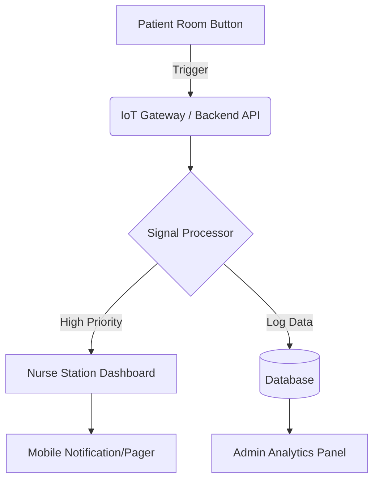
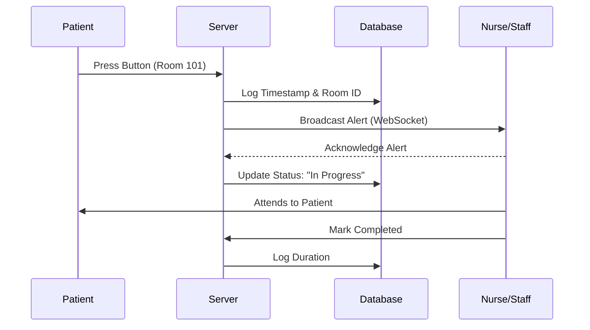

This README is designed for your **HospitalButton** project. Based on the name and common patterns for such systems, it assumes a solution designed to streamline hospital communication or emergency alerts (e.g., a "Nurse Call" or "Emergency Alert" system).

---

# 🏥 HospitalButton

**HospitalButton** is a smart healthcare communication solution designed to bridge the gap between patients and medical staff. With a single press, patients can trigger immediate alerts, ensuring rapid response times and improved patient safety.

## 🚀 Overview

In critical healthcare environments, every second counts. This project provides an end-to-end architecture for an emergency button system, featuring a real-time dashboard for nurses, automated priority queuing, and historical data logging for hospital management.

---

## 🏗️ System Architecture

The system follows a **Client-Server-Notification** architecture to ensure low latency and high reliability.



---

## 🛠️ Features

* **One-Touch Alert:** Simple interface for patients to request help instantly.
* **Priority Triaging:** Differentiates between routine requests (e.g., water) and emergency alerts (e.g., cardiac arrest).
* **Live Dashboard:** Real-time updates for medical staff using WebSockets.
* **Data Analytics:** Track response times and identify bottleneck wards.
* **Cross-Platform Support:** Accessible via Web, Tablet, and Mobile.

---

## 📊 Logic Flow

The diagram below explains how a request is handled once the button is pressed:



---

## 💻 Tech Stack

* **Frontend:** React.js / Vue.js (for the Dashboard)
* **Backend:** Node.js / Express or Python (FastAPI/Django)
* **Real-time:** Socket.io / MQTT
* **Database:** MongoDB / PostgreSQL
* **Hardware (Optional):** ESP32 / Arduino / Raspberry Pi

---

## 📸 Screenshots & UI

| Patient Interface | Nurse Dashboard | Analytics |
|  | --- | --- |
|  |  |  |

---

## ⚙️ Installation

1. **Clone the repository**
```bash
git clone https://github.com/Neha-Mazumder/HospitalButton.git
cd HospitalButton

```


2. **Install Dependencies**
```bash
# For Backend
cd backend
npm install

# For Frontend
cd ../frontend
npm install

```


3. **Configure Environment Variables**
Create a `.env` file in the root directory:
```env
PORT=5000
DB_URI=your_database_url

```


4. **Run the Application**
```bash
npm start

```


---

## 🤝 Contributing

Contributions are what make the open-source community such an amazing place to learn, inspire, and create.

1. Fork the Project
2. Create your Feature Branch (`git checkout -b feature/AmazingFeature`)
3. Commit your Changes (`git commit -m 'Add some AmazingFeature'`)
4. Push to the Branch (`git push origin feature/AmazingFeature`)
5. Open a Pull Request

---
